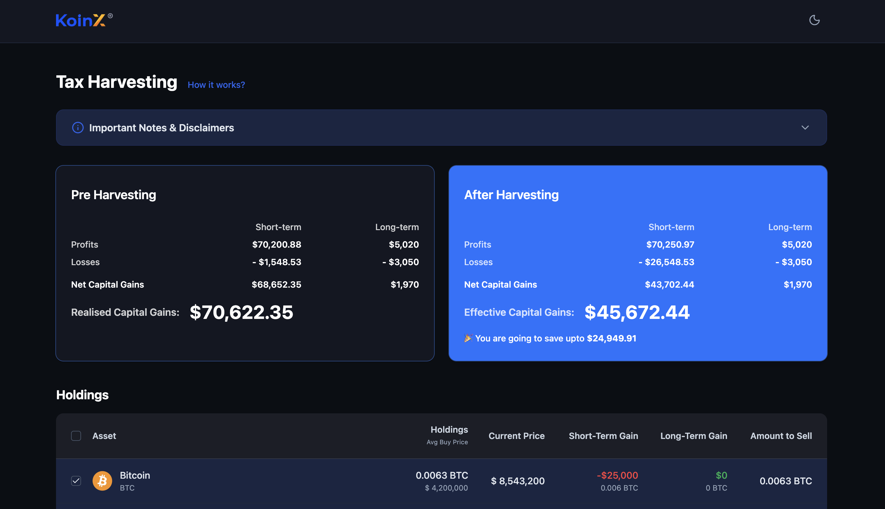
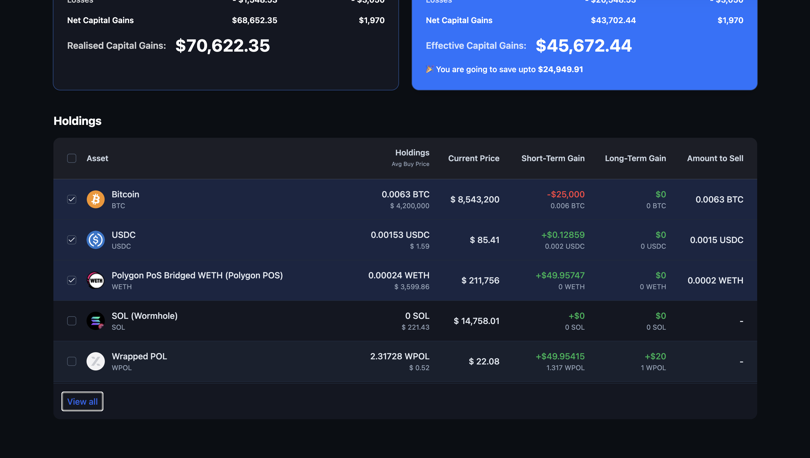

# Tax Loss Harvesting UI

A responsive, pixel-perfect frontend for a Tax Loss Harvesting tool, built with React, Vite, Tailwind CSS, and Shadcn UI.

## Features

- **Pre-Harvesting & Post-Harvesting Cards**: View your capital gains before and after harvesting losses.
- **Dynamic Calculation**: Selecting assets from the table instantly recalculates Short-Term and Long-Term Capital Gains.
- **Savings Alert**: See how much you will save on taxes when harvesting results in lower realised capital gains.
- **Interactive Holdings Table**: Checkbox selection for individual assets, plus a "select all" option.
- **Mock API Service**: Includes simulated network requests with realistic delay states for seamless UX.

## Tech Stack

- **Framework**: React 19 via Vite
- **Language**: TypeScript
- **Styling**: Tailwind CSS v3
- **Components**: Shadcn UI (Radix primitives + Lucide Icons)

## Setup Instructions

To run this project locally on your machine, follow these steps:

1. **Clone the repository** (or unzip the project folder):
   ```bash
   cd tax-loss-harvesting
   ```

2. **Install dependencies**:
   ```bash
   npm install
   ```

3. **Start the development server**:
   ```bash
   npm run dev
   ```

4. Open [http://localhost:5173](http://localhost:5173) in your browser to view the application.

5. **Build for production**:
   ```bash
   npm run build
   ```

## Assumptions

- **Tax Logic**: Added positive capital gains to profits and the absolute value of negative capital gains to losses. This aligns with the assignment description requirements.
- **Mock APIs**: Used `setTimeout` and JS Promises to mock the network requests seamlessly within the frontend itself.
- **Figma Design**: The UI layout and colors were reconstructed thoughtfully to closely resemble a premium Web3 / Fintech aesthetic (Dark background left card, Blue background right card) based on the textual descriptions, as direct visual access to the Figma file was substituted with high-quality responsive components from Shadcn UI.

## Screenshots



